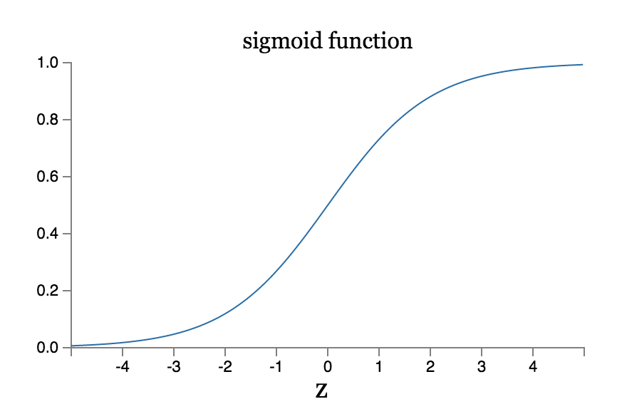

# 神经网络与深度学习

* Sigmoid

  神经元的输入:
  $$
  z = \sum_i w_i x_i + b
  $$

  * sigmoid函数:

$$
  \sigma(z) = \frac{1}{1 + e^{-z}}
$$

  * sigmoid函数导数:

$$
  \sigma^{'}(z) = \sigma(z) (1-\sigma(z))
$$

  * sigmoid函数图像:

    

* 深度学习为什么难以训练

  * 梯度消失&梯度爆炸

    根据反向传播算法,设前向传播有:
    $$
    f_{i+1} = f (f_i * W_{i+1} + b_{i+1})
    $$
    梯度下降以目标的负梯度方向对参数进行调整,参数的更新为:
    $$
    w \leftarrow w + \Delta w
    $$
    根据链式法则进行求导:
    $$
    \Delta w_2 = \frac{\partial Loss }{\partial w_2} = \frac{\partial Loss}{\partial f_3} \frac{\partial f_3}{\partial f_2}\frac{\partial f_2}{\partial w_2}
    $$

